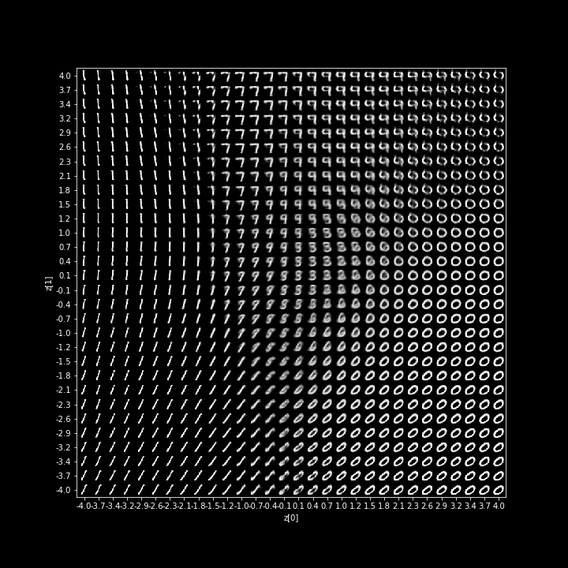

# VAE_CNN_Keras_TF2.0
Two different implementations of a Variational Autoencoder VAE with convolutional neural networks via Tesorflow 2.0/Keras.

Both are encapulated into an object wich a train() (or alternativle load_weights()) and carries accesible enoder, decoder, 
and vae models inside them.

Thier implementation hover differ. I did this for learning better how to implement statistical nodes and predictive models via tf2.0/keras.

Whilst I don't claim any stability for implementation, I think it is very educational for understanding
both the concepts of VAE and the options Keras have to implement statistical nodes and complex
loss functions and divergeses.

It is tested here on MNIST dataset. Performence wise, both are pretty identical.

Class VAE_CNN1 is smilar to the Keras reference example: https://keras.io/examples/variational_autoencoder_deconv/

Class VAE_CNN2 is in accordance with the nice description of Tiao: http://louistiao.me/posts/implementing-variational-autoencoders-in-keras-beyond-the-quickstart-tutorial/

